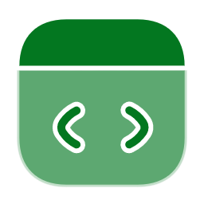
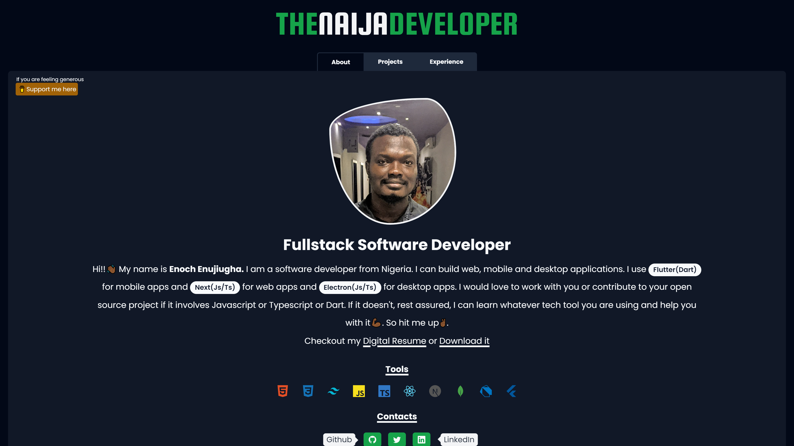
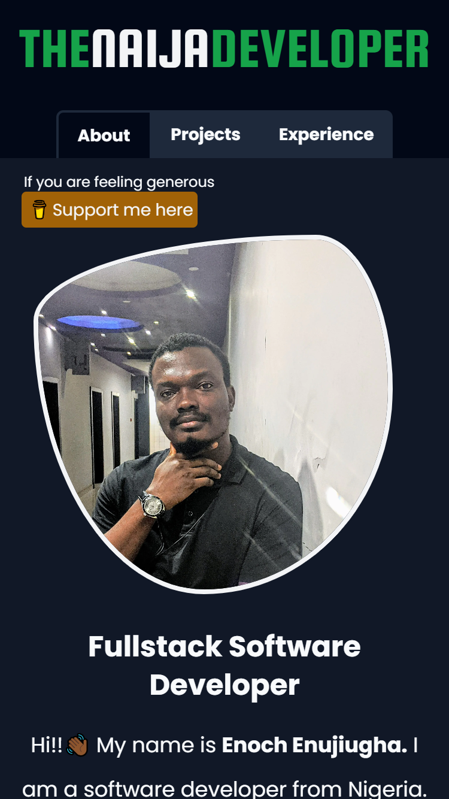
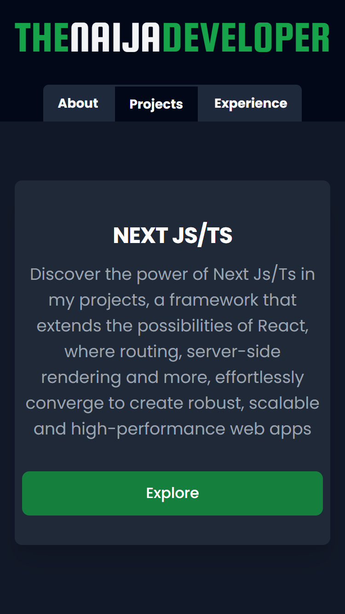
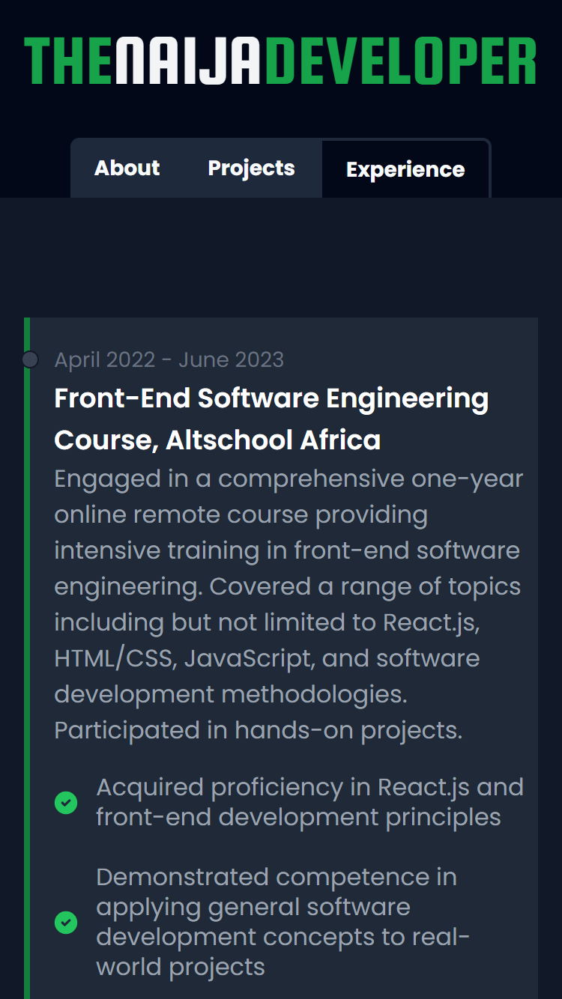

 

   

 

  

  <h3 align="center">NaijaDev Portfolio</h3>

  

    Check out my portfolio showcasing my work as a full-stack software developer. I bring ideas to life with code
     
  

<!-- TABLE OF CONTENTS -->

  
Table of Contents

  <ol>
    <li>
      <a href="#about-the-project">About The Project</a>
      <ul>
        <li><a href="#built-with">Built With</a></li>
      </ul>
    </li>
    <li><a href="#screenshots">Screenshots</a></li>
    <li><a href="#contact">Contact</a></li>
  </ol>

<!-- ABOUT THE PROJECT -->

## About The Project

Crafted with passion and purpose, my portfolio serves as a digital testament to my journey and capabilities as a full-stack software developer. By showcasing my projects. I aim to illustrate not just what I've created but also the problem-solving mindset, creativity, and technical prowess I bring to every endeavor. This portfolio not only highlights my skills but also serves as a platform for networking, career advancement, and potential collaborations. It allows potential employers, clients, and collaborators to gain insight into my expertise, approach to development, and the value I can bring to their projects. With this comprehensive showcase, I aim to forge meaningful connections, seize new opportunities, and continually evolve as a developer in the dynamic landscape of technology.✌🏾

### Built With

- 
- 
- 
- 
- 

## Screenshots

  
  
  

## Contact

- [Twitter@naijadeveloper](https://twitter.com/naijadeveloper)

- [LinkedIn@enochenujiugha](https://www.linkedin.com/in/enoch-enujiugha-b12247112)

- [Portfolio](https://naijadev.vercel.app/)

- mmejuenoch@gmail.com / naijadeveloper@gmail.com
